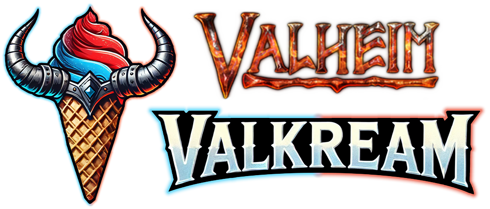

# Valkream-Launcher

Launcher et système de mise à jour pour le serveur Valheim Valkream.



## Table des matières

- [Présentation](#présentation)
- [Fonctionnalités](#fonctionnalités)
- [Structure du projet](#structure-du-projet)
- [Installation (Développement)](#installation-développement)
- [Utilisation (Développement)](#utilisation-développement)
- [Déploiement (Production)](#déploiement-production)
- [Auteurs](#auteurs)

---

## Présentation

Ce projet comprend :

- Un launcher Electron pour Valheim moddé
- Un serveur backend de gestion des mises à jour

---

## Fonctionnalités

### Frontend (Electron Launcher)

- 🚀 **Téléchargement & mise à jour automatique** du launcher et du jeu (via HTTPS sécurisé)
- 🆚 **Vérification de la version** locale et en ligne du jeu/modpack
- 🧩 **Installation/Désinstallation** du jeu, des mods et du modpack Thunderstore
- 🎉 **Gestion des événements spéciaux** (affichage dynamique dans l’interface)
- 🖥️ **Affichage des infos serveur** (joueurs, statut, ping, etc.)
- 🛡️ **Vérification d’intégrité** des plugins et configs (hash)
- 🎮 **Détection & gestion de l’installation Steam**
- 💬 **Notifications modernes** (snackbar, popup)
- 🖱️ **Interface multi-plateforme** (Windows, Linux, Mac)
- 🛑 **Mode maintenance** (affichage automatique si serveur en maintenance)
- 🌐 **Liens directs réseaux sociaux** (Discord, site web, top serveurs)
- 🔄 **Mise à jour automatique** du launcher via electron-updater
- 🎮 **Ouverture de steam** quand le jeu est lancé

### Backend (Node.js Update Server)

- 🔒 **API REST sécurisée** (authentification par API Key & Token pour les opérations critiques)
- 📦 **Téléchargement & upload** des versions du launcher, du jeu, des configs
- ♻️ **Changement de version** (rollback possible)
- 🎉 **Gestion des événements spéciaux** (modification via API)
- 🗂️ **Archivage & gestion des anciennes versions**
- 📝 **Logs d’activité** pour toutes les opérations critiques
- 🛡️ **Protection DDoS** (rate limiting sur GET/POST)
- 🐳 **Déploiement Docker** (production facile)
- 🔐 **Reverse proxy nginx avec SSL** (HTTPS natif, certificats personnalisables)
- 🗃️ **Isolation des fichiers sensibles** (certificats SSL, .env)
- 📊 **Logs d’accès et d’erreur** pour audit et sécurité

---

## Structure du projet

- `frontend-electron-launcher/` : Le launcher Electron (interface utilisateur)
- `backend-update-server/` : Serveur Node.js pour la gestion des mises à jour
- `infra/` : Exemple de fichiers de configuration et de déploiement (Docker, nginx, etc.)

---

> **⚠️ Attention** : Certains fichiers et dossier sont masqués sous vscode. (ex: les dossiers `/node_modules`). Ces fichiers sont masqués via le fichier `.vscode/settings.json`

## Installation (Développement)

### Prérequis

- Node.js (version : 22+)
- Yarn

### Installation des dépendances

À la racine du projet :

```bash
yarn install
```

---

## Utilisation (Développement)

### Lancer le serveur de mise à jour (backend)

```bash
cd backend-update-server
yarn run start # ou yarn run dev
```

### Lancer le launcher Electron (frontend)

```bash
cd frontend-electron-launcher
yarn dev
```

---

## Déploiement (Production)

Le déploiement en production se fait via **Docker Compose** et un reverse proxy **nginx** pour la gestion du SSL.

> **⚠️ Remarque :** En production, toutes les versions et fichiers uploadés sont stockés dans le dossier `infra/uploads`. Il est donc **crucial** de copier le dossier `infra` (et son contenu) dans un emplacement sécurisé et accessible avant le déploiement, afin de garantir la pérennité et la sécurité des données. **Ce dossier ne pourra et ne devra pas être supprimé sous aucun prétexte.**

### 1. Préparer la configuration du backend

- Placez votre fichier `.env` dans le dossier `infra/` pour configurer le backend.
  - Exemple de variables à définir :
    ```
    PORT=3000
    apiKey=VOTRE_API_KEY_COMPLEXE
    apiToken=VOTRE_API_TOKEN_COMPLEXE
    ```
- Adaptez les clés API et tokens pour la sécurité.

### 2. Configurer les certificats SSL

- Placez vos certificats SSL dans le dossier `infra/nginx/certs/` :
  - `fullchain.pem` : le certificat complet (généralement fourni par Let's Encrypt ou votre autorité de certification)
  - `privkey.pem` : la clé privée associée
- Ces fichiers seront utilisés par nginx, comme défini dans `infra/nginx/nginx.conf` :
  ```
  ssl_certificate /etc/nginx/certs/fullchain.pem;
  ssl_certificate_key /etc/nginx/certs/privkey.pem;
  ```
- Si vous changez de certificat, remplacez simplement ces deux fichiers dans le dossier `certs/`.

### 3. Lancer le déploiement

- Depuis le dossier `infra/` :
  ```bash
  cd infra
  docker-compose up -d
  ```
- Le backend sera alors accessible via HTTPS sur le port 3001 (ou celui défini dans la conf nginx).

### 4. Accès sécurisé

- L’accès au backend se fait via l’URL HTTPS de votre serveur, par exemple :  
  `https://votre_domaine_ou_ip:3001`
- Le reverse proxy nginx s’occupe de rediriger les requêtes vers le backend Node.js (port 3000 par défaut).

---

## Auteurs

- Valkream Team
